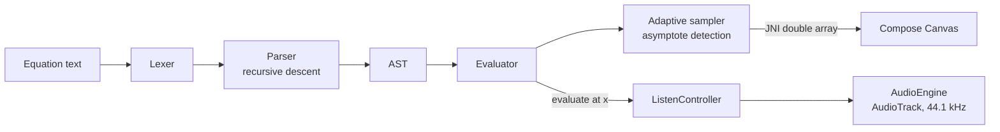

<div align="center">
<p align="center">
  
</p>


# GraphSonic

### See math. Hear math.

A graphing calculator for Android that **plots your equations and plays them as sound**.
Powered by a hand-written **C++17 math engine** and a fully **Jetpack Compose** UI.

<p>
  <a href="https://github.com/anuj990/GraphSonic/stargazers"></a>
  <a href="https://github.com/anuj990/GraphSonic/network/members"></a>
  <a href="https://github.com/anuj990/GraphSonic/issues"></a>
  <a href="https://github.com/anuj990/GraphSonic/pulls"></a>
</p>

<p>
  
  
  
  
  
  
  
  
  
</p>

<!-- Replace with a 10-15 second screen recording: docs/demo.gif -->


**If GraphSonic made you smile, a ⭐ helps a lot!**

</div>

---

## Why GraphSonic?

Most graphing apps only show you a curve. GraphSonic lets you **hear** it: pitch follows the value of `y` as a playhead sweeps along `x`. You notice peaks, zeros, jumps, and asymptotes with your ears, not just your eyes. It is a fun way to learn functions, and a useful one for anyone who cannot rely on sight alone.

## Screenshots

<!-- Put images in docs/screenshots/ and keep the file names below -->
| Equation input | Multi-graph | Listen mode | History |
|:---:|:---:|:---:|:---:|
|  |  |  |  |

| Dark theme | Trace cursor | Asymptotes (`tan(x)`, `1/x`) |
|:---:|:---:|:---:|
|  |  |  |

## Features

**Graphing**
- Up to **8 equations** at once, each with its own color, show/hide, and mute toggle
- **Pinch to zoom, drag to pan**, with an adaptive grid and axis labels
- **Long-press and drag** to trace: read `x` and `y` for every visible curve
- Curves **re-sample when you stop moving**, so they stay smooth at any zoom
- Smart handling of **asymptotes and undefined regions** (`tan(x)`, `1/x`, `√x`, `ln(x)`)
- Duplicate detection: `x²` and `x^2` are recognized as the same equation

**Sonification (Listen mode)**
- A playhead sweeps across the graph and turns `y` into pitch
- **Continuous** or **Musical** mode (snaps to notes and shows the note name)
- **4 waveforms:** sine, triangle, square, saw
- Adjustable **speed** and **volume**
- **Polyphonic:** every enabled equation plays as its own voice (up to 16 voices)
- Live readout of `x`, `y`, frequency, and note

**Convenience**
- Saved **history** of your last 100 equations, one tap to graph again
- Material 3 design with **dynamic color** and light/dark themes

## Supported math

| Category | Syntax |
|---|---|
| Operators | `+  -  *  /  ^`, also `×  ÷  −` |
| Powers | `x^2`, `x²`, `x⁻³`, `sin²(x)` |
| Roots | `sqrt(x)`, `√x`, `cbrt(x)`, `∛x` |
| Trig | `sin cos tan cot sec csc` |
| Inverse trig | `asin acos atan` (also `arcsin`, `arccos`, `arctan`) |
| Hyperbolic | `sinh cosh tanh` |
| Logs and more | `ln`, `log` (base 10), `exp`, `abs` |
| Constants | `pi`, `π`, `e` |
| Shortcuts | implicit multiplication: `2x`, `3(x+1)`, `(x+1)(x-1)` |

Try: `sin(x)/x` · `x³ - 3x` · `tan(x)` · `e^(-x²)` · `√(25 - x²)`

## How it works



- **Native engine (C++17):** the lexer, parser, evaluator, and adaptive sampler run in C++ and are called through JNI. The sampler subdivides where the curve bends and breaks the line at discontinuities.
- **UI (Kotlin + Compose):** MVVM with `StateFlow`. The graph is drawn on a single Compose `Canvas` with custom gesture handling.
- **Audio:** a dedicated thread mixes up to 16 voices into 16-bit PCM and streams it with `AudioTrack`.

## Project structure

```
app/src/main
├── cpp/                     # C++ engine
│   ├── math/                #   Lexer, Parser, AST, Evaluator
│   ├── graph/               #   Adaptive GraphSampler
│   └── jni/                 #   NativeBridge
└── java/com/anuj/graphsonic
    ├── engine/              # Kotlin side of the JNI bridge
    ├── data/history/        # Equation history storage
    ├── domain/model/        # GraphData, GraphPoint
    ├── feature/
    │   ├── equation/        #   Equation input screen
    │   ├── visualization/   #   Graph canvas, viewport, cursor, ViewModel
    │   ├── audio/           #   Audio engine, listen controller, mappers
    │   ├── history/         #   History screen
    │   └── navigation/      #   NavHost and bottom bar
    └── ui/                  # Theme, colors, typography
```

## Tech stack

| | |
|---|---|
| Language | Kotlin 2.2, C++17 |
| UI | Jetpack Compose, Material 3, Navigation Compose |
| Architecture | MVVM, unidirectional data flow, `StateFlow` |
| Native | NDK, CMake 3.22.1, JNI |
| Audio | `AudioTrack` (PCM 16-bit, mono, 44.1 kHz) |
| Build | AGP 9.3, Gradle 9.5, version catalog |
| Min / Target SDK | 26 / 37 |

## Getting started

```bash
git clone https://github.com/anuj990/GraphSonic.git
cd GraphSonic
```

1. Open the folder in the latest **Android Studio**.
2. In **SDK Manager → SDK Tools**, install **NDK (Side by side)** and **CMake 3.22.1**.
3. Let Gradle sync, then press **Run** on a device or emulator (Android 8.0+).

Or build from the terminal:

```bash
./gradlew assembleDebug
```

## Download

[](https://github.com/anuj990/GraphSonic/releases/latest)

**Latest release:** [GraphSonic v1.0.0](https://github.com/anuj990/GraphSonic/releases/tag/v1.0.0)

Download the APK from the GitHub Releases page and install it on an Android device running Android 8.0 (API 26) or newer.

## Roadmap

- [ ] Custom math keyboard
- [ ] Audio scrubbing: drag to control the playhead and hear the pitch instantly
- [ ] TalkBack support: step through the graph and announce `x`, `y`, and note
- [ ] Pitch mapped to the visible y-range instead of `|y|`
- [ ] More functions: `sign`, `|x|`
- [ ] Export graph as PNG and sound as WAV
- [ ] Tablet and landscape two-pane layout
- [ ] Unit tests for the parser and sampler

Have an idea? [Open an issue](https://github.com/anuj990/GraphSonic/issues/new).

## Contributing

Contributions are welcome, from typo fixes to new features.

1. Fork the repo and create a branch: `git checkout -b feature/my-idea`
2. Commit your changes and push the branch
3. Open a pull request describing what you changed and why

Good first issues: new math functions in `Evaluator.cpp` and `Lexer.cpp`, new waveforms in `AudioEngine.kt`, or a new color palette.

## Stats

<div align="center">

<a href="https://github.com/anuj990/GraphSonic">
  
</a>

<a href="https://star-history.com/#anuj990/GraphSonic&Date">
  
</a>

**Contributors**

<a href="https://github.com/anuj990/GraphSonic/graphs/contributors">
  
</a>


</div>

## Author

**Anuj**, Android developer · [GitHub @anuj990](https://github.com/anuj990)

---

<div align="center">

**Built with Kotlin, C++, and a love for math you can hear.**

If you liked it, please **⭐ star the repo** and share it with a friend who is learning functions.

</div>
